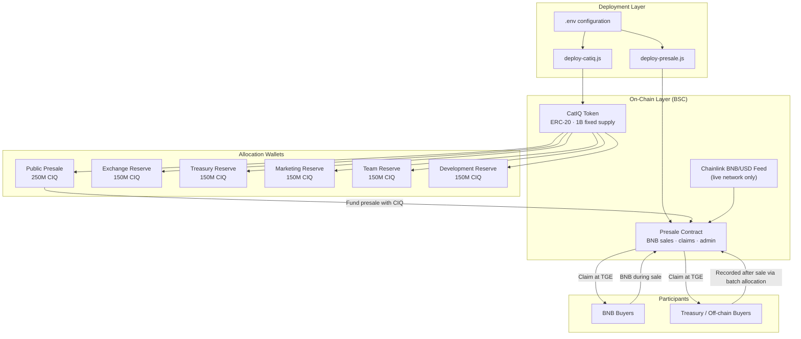
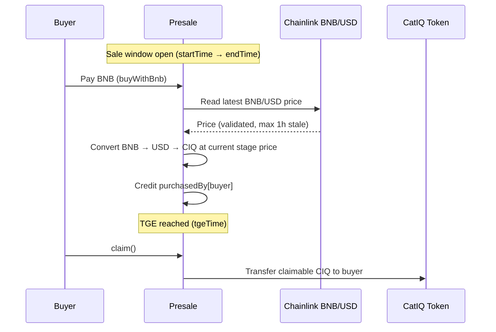

# CatIQ ICO Smart Contracts

Smart contract system for the **CatIQ** token and its **BNB-based public presale** on Binance Smart Chain (BSC). This repository is the single source of truth for how CIQ is minted, allocated, sold, claimed, and administered on-chain.

---

## Features

- **Fixed-supply ERC-20 token** — 1 billion CIQ minted once at deploy across six allocation wallets; no additional minting
- **BNB presale** — participants buy CIQ with native BNB during a configurable sale window
- **Chainlink oracle pricing** — live BNB/USD conversion with staleness checks (max 1 hour)
- **Three-stage pricing** — owner can switch between tier 1, 2, and 3 USD prices during the sale
- **TGE claim model** — purchases are credited on-chain; tokens are claimed after Token Generation Event
- **Off-chain payment support** — USDT, USDC, and ETH sales recorded via owner batch allocation after sale end
- **Admin toolkit** — update sale window, TGE, stage prices, withdraw BNB, recover unsold CIQ, finalize sale
- **Buy quote preview** — on-chain quote for BNB → CIQ before purchase (frontend-friendly)
- **Reentrancy protection** — guarded buy and claim paths
- **BscScan-ready deployment** — deploy scripts print verify commands; constructor arg helpers included
- **Full test coverage** — Hardhat suites for token supply, presale flow, claims, and admin actions
- **BSC mainnet & testnet** — Hardhat networks preconfigured for Binance Smart Chain

---

## Commands

Run all commands from the project root. Copy `.env.example` to `.env` and fill in values before deploy or verify on a live network.

### Install dependencies

```shell
npm install
```

### Compile contracts

```shell
npx hardhat compile
```

Force a clean rebuild:

```shell
npx hardhat clean && npx hardhat compile
```

### Run tests

Run the full test suite:

```shell
npx hardhat test
```

Run a single test file:

```shell
npx hardhat test test/CatiQ.test.js
npx hardhat test test/Presale.test.js
```

### Deploy

**BSC Testnet**

```shell
npx hardhat run scripts/deploy-catiq.js --network bscTestnet
```

After deploy, set `CATIQ_ADDRESS` in `.env`, then:

```shell
npx hardhat run scripts/deploy-presale.js --network bscTestnet
```

**BSC Mainnet**

```shell
npx hardhat run scripts/deploy-catiq.js --network bscMainnet
```

After deploy, set `CATIQ_ADDRESS` in `.env`, then:

```shell
npx hardhat run scripts/deploy-presale.js --network bscMainnet
```

Each deploy script prints a **Verify with:** line at the end — copy and run that command after deployment.

### Verify on BscScan

Ensure `BSCSCAN_API_KEY` is set in `.env`.

**Option A — use constructor-args files (recommended)**

CatIQ:

```shell
npx hardhat verify --network bscTestnet <CATIQ_ADDRESS> --constructor-args scripts/args.js
```

Presale:

```shell
npx hardhat verify --network bscTestnet <PRESALE_ADDRESS> --constructor-args scripts/presale-args.js
```

Replace `bscTestnet` with `bscMainnet` for mainnet verification. Replace `<CATIQ_ADDRESS>` and `<PRESALE_ADDRESS>` with deployed contract addresses.

**Option B — inline constructor arguments**

CatIQ:

```shell
npx hardhat verify --network bscTestnet <CATIQ_ADDRESS> <PP_WALLET> <EXCHANGE_WALLET> <TREASURY_WALLET> <MARKETING_WALLET> <TEAM_WALLET> <DEV_WALLET>
```

Presale:

```shell
npx hardhat verify --network bscTestnet <PRESALE_ADDRESS> <CATIQ_ADDRESS> <BNB_USD_PRICE_FEED> "[<STAGE1>,<STAGE2>,<STAGE3>]" <START_TIME> <END_TIME> <TGE_TIME>
```

Example Presale values:

```shell
npx hardhat verify --network bscTestnet 0xPresaleAddress 0xCatIQAddress 0x2514895c72f50D8bd4B4F9b1110f0D6bD2c97526 "[1000000,2000000,3000000]" 1717200000 1719800000 1720400000
```

---

## Table of Contents

1. [Features](#features)
2. [Commands](#commands)
3. [Project Overview](#project-overview)
4. [Architecture](#architecture)
5. [Repository Structure](#repository-structure)
6. [Tokenomics](#tokenomics)
7. [Contract Responsibilities](#contract-responsibilities)
8. [Presale Lifecycle](#presale-lifecycle)
9. [Pricing & Oracle](#pricing--oracle)
10. [Admin Controls](#admin-controls)
11. [Deployment Order](#deployment-order)
12. [Configuration](#configuration)
13. [Networks](#networks)
14. [Testing](#testing)
15. [Operational Checklist](#operational-checklist)
16. [Security Notes](#security-notes)

---

## Project Overview

CatIQ is an ERC-20 token with a fixed **1 billion CIQ** total supply. At deployment, the full supply is minted once and distributed to six predefined allocation wallets. No further minting is possible.

The **Presale** contract handles the public sale window. Participants pay **BNB**; the contract converts BNB to a USD value using a **Chainlink BNB/USD price feed**, then credits CIQ at the active stage price. Tokens are **not transferred immediately** — buyers **claim** their allocation after **Token Generation Event (TGE)**.

A separate **off-chain allocation path** exists for treasury-style sales (e.g. USDT, USDC, or ETH handled outside the contract). After the sale ends, the owner can record those allocations on-chain via batch allocation so beneficiaries can claim at TGE like BNB buyers.

---

## Architecture

### High-Level System Diagram



### Presale Internal Flow



### Component Relationships

| Component | Role | Depends On |
|-----------|------|------------|
| **CatIQ** | Fixed-supply ERC-20; mints 1B at deploy to six wallets | OpenZeppelin ERC-20, Ownable |
| **Presale** | BNB purchases, vesting-style claim at TGE, admin ops | CatIQ, Chainlink feed, OpenZeppelin |
| **BnbUsdFeedStub** | Test-only mock oracle | Used only in local Hardhat tests |
| **Deploy scripts** | Read `.env`, deploy contracts, log addresses | Hardhat, ethers |
| **Hardhat config** | Networks (BSC mainnet/testnet), compiler, BscScan verify | `.env` RPC + private key |

---

## Repository Structure

```
CIQ ICO Contracts/
│
├── contracts/                    # On-chain logic (Solidity 0.8.28)
│   ├── CatIQ.sol                 # ERC-20 token — fixed 1B supply, six-wallet mint
│   ├── Presale.sol               # BNB presale, oracle pricing, claims, admin
│   └── BnbUsdFeedStub.sol        # Local test stub for BNB/USD (not for production)
│
├── scripts/                      # Deployment & verification helpers
│   ├── deploy-catiq.js           # Deploy CatIQ with wallet addresses from env
│   ├── deploy-presale.js         # Deploy Presale with token, feed, prices, times
│   ├── args.js                   # Constructor args export for CatIQ verification
│   └── presale-args.js           # Constructor args export for Presale verification
│
├── test/                         # Hardhat + Chai test suites
│   ├── CatiQ.test.js             # Token name, supply, allocations, transfers
│   └── Presale.test.js           # Buying, stages, claims, admin, batch allocation
│
├── hardhat.config.js             # Solidity compiler, BSC networks, gas reporter
├── .env.example                  # Template for all required environment variables
├── .env                          # Local secrets (gitignored — never commit)
├── package.json                  # Dependencies: Hardhat, OpenZeppelin, Chainlink
└── README.md                     # This document
```

---

## Tokenomics

**Total supply:** 1,000,000,000 CIQ (18 decimals)

| Allocation | Amount (CIQ) | Purpose |
|------------|--------------|---------|
| Public Presale | 250,000,000 | Funded into Presale contract for BNB sale (+ off-chain allocation pool) |
| Exchange Reserve | 150,000,000 | Exchange / liquidity reserve |
| Treasury Reserve | 150,000,000 | Treasury operations |
| Marketing Reserve | 150,000,000 | Marketing initiatives |
| Team Reserve | 150,000,000 | Team allocation |
| Development Reserve | 150,000,000 | Development fund |

All tokens are minted in the constructor. The deployer becomes **owner** of CatIQ (Ownable) but does not receive a token allocation by default.

---

## Contract Responsibilities

### CatIQ

- Standard ERC-20 token named **CatIQ**, symbol **CIQ**
- **Single mint event** at deployment — no burn, no additional mint functions
- Requires six non-zero wallet addresses at deploy
- Owner role exists (OpenZeppelin Ownable) for future token-level admin if extended

### Presale

- Accepts **BNB only** during the active sale window via `buyWithBnb`
- Three **pricing stages** (stage 0, 1, 2) — owner switches active stage during sale
- Prices are denominated in **USD with 8 decimal places** per CIQ token
- Purchases are recorded in `purchasedBy`; actual token transfer happens at **claim** after TGE
- **Quote function** available for frontends to preview CIQ amount for a given BNB input
- **Reentrancy protection** on buy and claim
- **Sale finalization** flag stops further configuration and marks sale as closed
- **Withdraw BNB** to owner-designated address
- **Withdraw unsold CIQ** after sale ends (respects outstanding unclaimed buyer balances)
- **Batch allocation** (max 200 addresses per tx) for off-chain payment recording after sale ends

### BnbUsdFeedStub

- Exists **only for local testing**
- Production deployments must use the real **Chainlink BNB/USD aggregator** on BSC

---

## Presale Lifecycle

### Phase 1 — Pre-Sale Setup

1. Deploy **CatIQ** with correct allocation wallet addresses
2. Deploy **Presale** with CatIQ address, Chainlink feed, stage prices, and timestamps
3. Transfer CIQ from the **Public Presale wallet** into the Presale contract (must cover expected sale volume)
4. Confirm sale window: `startTime` < `endTime` ≤ `tgeTime`

### Phase 2 — Active Sale

- Sale is active when: current time is within `[startTime, endTime]`, and sale is not finalized
- Buyers send BNB; contract credits CIQ entitlement at the **current stage** price
- Owner may advance pricing stage (0 → 1 → 2) as the sale progresses
- Owner may adjust sale window or TGE time **only before finalization** (with validation rules)

### Phase 3 — Sale End

- Sale ends automatically when `endTime` passes, or early via `finalizeSale`
- Owner withdraws collected **BNB**
- Owner runs **batchSetAllocation** for any USDT/USDC/ETH (or other off-chain) buyers — credits their `purchasedBy` balances
- Owner may withdraw **unsold CIQ** that is not owed to unclaimed buyers

### Phase 4 — TGE & Claims

- After `tgeTime`, any address with a `purchasedBy` balance can **claim** CIQ
- Claims are one-way: `claimedBy` tracks what has already been sent
- Partial claims are supported implicitly (full remaining balance claimed each time)

---

## Pricing & Oracle

### Stage Pricing

- Three fixed stage prices are set at Presale deployment
- Only **one stage is active** at a time (`currentStage`: 0, 1, or 2)
- Price format: USD per 1 CIQ, **8 decimals** (e.g. $0.01 = `1000000`)

### BNB → CIQ Conversion

1. Read BNB/USD from Chainlink aggregator
2. Validate: positive price, complete round, fresh data (max **1 hour** staleness)
3. Normalize oracle decimals to 8-decimal USD
4. Compute USD value of BNB sent
5. Divide by active stage price to get CIQ amount (18 decimals)

### Direct BNB Transfers

- The contract accepts plain BNB via `receive()` but **does not allocate tokens**
- Mistaken sends can be recovered by the owner via `withdrawBnb`

---

## Admin Controls

All Presale admin functions are **owner-only**.

| Action | When Allowed | Effect |
|--------|--------------|--------|
| `setSaleWindow` | Before finalization | Update start/end times (end must be ≤ TGE) |
| `setTgeTime` | Before finalization | Update TGE (must be ≥ end time) |
| `setCurrentStage` | Before finalization | Switch active price tier (0–2) |
| `setStagePrices` | Before finalization | Update all three stage prices |
| `finalizeSale` | Anytime | Permanently lock sale config |
| `withdrawBnb` | Anytime | Send collected BNB to a wallet |
| `withdrawUnsoldTokens` | After sale end or finalization | Recover excess CIQ in contract |
| `batchSetAllocation` | After sale end or finalization | Credit off-chain buyers for TGE claim |

CatIQ owner (deployer) currently has no custom admin functions beyond standard Ownable — token supply is fully minted at deploy.

---

## Deployment Order

| Step | Action | Script / Tool |
|------|--------|---------------|
| 1 | Copy `.env.example` → `.env` and fill all values | Manual |
| 2 | Install dependencies | `npm install` |
| 3 | Run tests locally | `npx hardhat test` |
| 4 | Deploy CatIQ to target network | `npx hardhat run scripts/deploy-catiq.js --network <network>` |
| 5 | Set `CATIQ_ADDRESS` in `.env` | Manual |
| 6 | Deploy Presale | `npx hardhat run scripts/deploy-presale.js --network <network>` |
| 7 | Transfer 250M (or planned sale amount) CIQ from PP wallet to Presale | Wallet / script |
| 8 | Verify contracts on BscScan | See [Commands → Verify](#verify-on-bscscan) or use the command printed by deploy scripts |
| 9 | Open sale at `startTime` | Automatic on-chain |

**Networks configured in Hardhat:** `hardhat` (local), `bscTestnet` (chainId 97), `bscMainnet` (chainId 56)

---

## Configuration

All secrets and deployment parameters live in **`.env`**. Use **`.env.example`** as the reference.

### Network & Tooling

| Variable | Purpose |
|----------|---------|
| `PRIVATE_KEY` | Deployer wallet for BSC transactions |
| `BSC_MAINNET_RPC_URL` | BSC mainnet JSON-RPC endpoint |
| `BSC_TESTNET_RPC_URL` | BSC testnet JSON-RPC endpoint |
| `BSCSCAN_API_KEY` | Contract verification on BscScan |

### CatIQ Deployment Wallets

| Variable | Receives |
|----------|----------|
| `PP_WALLET` | 250M CIQ (public presale allocation) |
| `EXCHANGE_WALLET` | 150M CIQ |
| `TREASURY_WALLET` | 150M CIQ |
| `MARKETING_WALLET` | 150M CIQ |
| `TEAM_WALLET` | 150M CIQ |
| `DEV_WALLET` | 150M CIQ |

### Presale Deployment

| Variable | Purpose |
|----------|---------|
| `CATIQ_ADDRESS` | Deployed CatIQ contract |
| `BNB_USD_PRICE_FEED` | Chainlink BNB/USD aggregator address |
| `PRESALE_USD_PRICE_STAGE1` | Stage 0 price (8-decimal USD) |
| `PRESALE_USD_PRICE_STAGE2` | Stage 1 price |
| `PRESALE_USD_PRICE_STAGE3` | Stage 2 price |
| `PRESALE_START_TIME` | Unix timestamp — sale opens |
| `PRESALE_END_TIME` | Unix timestamp — sale closes |
| `PRESALE_TGE_TIME` | Unix timestamp — claims enabled |

**Timestamp rule:** `PRESALE_START_TIME` < `PRESALE_END_TIME` ≤ `PRESALE_TGE_TIME`

### Chainlink BNB/USD Feed Addresses (reference)

| Network | Aggregator |
|---------|------------|
| BSC Mainnet | `0x0567F2323251f0Aab15c8dFb1967E4e8A7D42aeE` |
| BSC Testnet | `0x2514895c72f50D8bd4B4F9b1110f0D6bD2c97526` |

---

## Networks

| Network | Chain ID | Use Case |
|---------|----------|----------|
| Hardhat | 31337 | Local development & automated tests |
| BSC Testnet | 97 | Staging, integration testing, testnet presale |
| BSC Mainnet | 56 | Production token and presale |

Solidity **0.8.28** with optimizer enabled (200 runs).

---

## Testing

Test suites cover:

**CatIQ**
- Token metadata (name, symbol, decimals)
- Correct mint amounts per allocation wallet
- Total supply equals 1 billion
- Deployer ownership
- Transfers between wallets
- Revert on zero-address constructor inputs

**Presale**
- Deployment configuration (token, prices, times)
- BNB purchases during active window
- Revert before sale start
- Stage price switching (tier 2 rate)
- Quote accuracy vs actual purchase
- Claim blocked before TGE, allowed after
- Owner-only admin restrictions
- BNB withdrawal
- Unsold token withdrawal after finalization
- Batch allocation (single and multiple beneficiaries)
- Batch allocation blocked before sale end
- Treasury-style allocation claimable at TGE

See [Commands → Run tests](#run-tests) for how to execute the suite.

---

## Operational Checklist

### Before Mainnet Deploy

- [ ] All six allocation wallet addresses verified (multisig where appropriate)
- [ ] Stage prices and timestamps reviewed and agreed
- [ ] Chainlink feed address matches target network
- [ ] Deployer wallet funded with sufficient BNB for gas
- [ ] `.env` values double-checked; `.env` not committed
- [ ] Full test suite passes
- [ ] Testnet dry-run completed end-to-end

### After Presale Deploy

- [ ] Presale contract funded with adequate CIQ from PP wallet
- [ ] Contract verified on BscScan
- [ ] Sale window and TGE confirmed on-chain
- [ ] Frontend wired to Presale address, `quoteBuyWithBnb`, and claim flow
- [ ] Owner keys secured (hardware wallet / multisig)

### After Sale Ends

- [ ] BNB withdrawn to treasury
- [ ] Off-chain buyers allocated via `batchSetAllocation`
- [ ] Unsold CIQ withdrawn if applicable
- [ ] `finalizeSale` called if not already ended by time
- [ ] TGE time communicated to community

### At TGE

- [ ] Confirm `block.timestamp >= tgeTime` on-chain
- [ ] Claim function available to all `purchasedBy` addresses
- [ ] Monitor claim transactions and remaining contract CIQ balance

---

## Security Notes

- **No upgradeability** — contracts are immutable after deploy; wrong constructor args cannot be fixed without redeployment
- **Oracle dependency** — BNB purchases require a live, fresh Chainlink feed; stale prices (>1 hour) revert purchases
- **Owner centralization** — Presale owner controls sale parameters, withdrawals, and off-chain allocations; use a multisig for production
- **Fund the presale** — Purchases revert if the Presale contract holds insufficient CIQ for credited sales
- **Unsold withdrawal safety** — `withdrawUnsoldTokens` subtracts outstanding unclaimed buyer entitlements before allowing withdrawal
- **Batch limit** — `batchSetAllocation` capped at 200 entries per transaction to bound gas
- **Reentrancy** — Buy and claim paths are guarded
- **Private keys** — Never commit `.env`; rotate any key that was ever exposed

---

## Tech Stack

| Layer | Technology |
|-------|------------|
| Language | Solidity 0.8.28 |
| Framework | Hardhat 2.x |
| Libraries | OpenZeppelin Contracts 5.x, Chainlink Contracts |
| Testing | Hardhat Toolbox, Chai, hardhat-network-helpers |
| Chain | Binance Smart Chain (EVM) |
| Oracle | Chainlink BNB/USD (production) |

---

## License

MIT (per contract SPDX headers).
